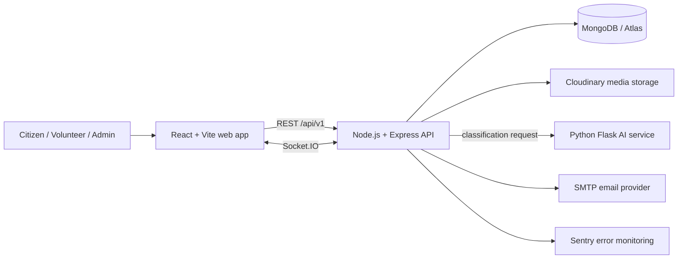

# StreetSetu – AI-Powered Street & Neighbourhood Action Platform

StreetSetu is a civic issue reporting and neighbourhood coordination platform. Citizens can submit location-aware complaints, administrators can review and assign work, and volunteers can track and document resolutions. The web application combines complaint workflows, maps, dashboards, notifications, and an AI-assisted classification service.

> **Project status:** This repository includes application code and deployment configuration. Hosting credentials, cloud resources, and public deployment URLs are environment-specific and are not included here.

## Overview

StreetSetu makes local civic issues easier to report and follow through. It gives citizens a way to submit evidence and see progress, while administrators and volunteers get tools to review, route, work on, and measure complaints.

### Problem statement

Civic issues are often reported across disconnected channels, with limited location context, unclear ownership, and little visibility into what happened next. StreetSetu provides a shared workflow that records issue details and evidence, tracks responsibility and status changes, and surfaces operational information to the people handling the work.

### Key features

- Role-based citizen, volunteer, and administrator experiences.
- Complaint submission with category, priority, map coordinates, and image attachments.
- Complaint lifecycle with a reasoned rejection path and recorded status history.
- Admin assignment, reassignment, and ranked volunteer recommendations.
- Volunteer work-start and completion evidence uploads.
- Lightweight completion metadata checks with admin evidence review; visual similarity inference is disabled on small-instance deployments.
- In-app notifications, optional email delivery, and Socket.IO updates.
- Complaint maps, nearby issue lookup, and dashboard analytics.
- Citizen nearby complaint discovery before submission with 500 m, 1 km, and 5 km search radii.
- Volunteer daily route planning with greedy nearest-neighbour ordering, distance/time estimates, and a Leaflet route map.
- Installable PWA with offline access to previously loaded dashboard, complaint, and notification data.
- Public transparency metrics and shareable no-login complaint tracking links.
- Citizen volunteer ratings after resolution, weighted volunteer leaderboard, and assignment accept/decline tracking.
- Fullscreen before/after evidence viewer with keyboard navigation and zoom.
- Audit activity, CSV export, and PDF reports for administrators.
- AI-assisted complaint classification through a separate Python service.

## Features

- **Anonymous reporting:** Citizens can mark a complaint anonymous. Public and citizen-facing views show “Anonymous” instead of the reporter's identity; authorized staff and the reporting citizen retain access according to the existing API permissions.
- **Automatic SLA escalation:** Complaint deadlines use `SLA_HIGH_MINUTES`, `SLA_MEDIUM_MINUTES`, and `SLA_LOW_MINUTES` (defaults: 1,440 / 2,880 / 4,320 minutes). The `ESCALATION_CRON` schedule defaults to once per minute. Public overdue complaints are available at `/overdue`; an administrator can trigger a run with `POST /api/v1/admin/escalation/run`.
- **Hindi and English:** The web interface provides an EN / हिंदी switcher and saves the language preference in browser local storage.
- **Volunteer drives:** Authenticated users can create drives and join or leave upcoming neighbourhood activities. The dashboard shows drive dates, locations, and participant counts.
- **Waste segregation guide and recycling map:** Search local examples across five waste categories and view sample Delhi/NCR recycling-center markers on OpenStreetMap. The sample center coordinates are illustrative and must be locally verified.

### AI & Verification

AI-assisted triage currently uses a lightweight TF-IDF/Logistic Regression text model to suggest complaint category and priority from the title and description; it does not perform YOLOv8 image classification. Suggestions are shown in the UI for human review. Completion evidence uses live-capture and available location/timestamp metadata checks. Visual before/after similarity is not enabled, so all completion evidence is routed to admin review (needs_review) before a complaint is marked resolved.

## Known Limitations / Roadmap

The following capabilities are **planned** and are not currently enabled:

- YOLOv8 image classification.
- Perceptual-hash/CNN before-and-after image similarity.
- Predictive hotspot mapping with DBSCAN.
- Offline support.
- Gamification certificates.
- Mobile parity for newer features, including volunteer drives and the segregation guide.

## Implemented capabilities

| Area | Current implementation |
|---|---|
| Authentication | Registration, login, logout, JWT access tokens, refresh-token flow, and role checks. |
| Complaint management | Create, list, view, filter, search, map, vote, verify, and update complaints. |
| Rejection workflow | Admin rejection from eligible review states with required reason, `rejectedAt`, `rejectedBy`, status history, and audit record. |
| Volunteer assignment | Admin assignment/reassignment and volunteer assignment list/status updates. |
| Smart recommendations | Top-five volunteer recommendations weighted by proximity (50%), active workload (25%), resolution rate (15%), and availability (10%). Admins can review, assign manually, or auto-assign the highest-ranked available volunteer. |
| Work evidence and images | Cloudinary-backed image upload configuration; complaint images and work-start evidence remain file uploads. Completion proof is captured by the live camera with a device GPS/time watermark and stored with its capture metadata. |
| Completion verification | Live camera device time, GPS distance and accuracy are checked before the existing verification flow; flagged proofs require admin review. |
| Location support | GeoJSON point coordinates, Leaflet/OpenStreetMap maps, map complaint listing, and nearby complaint lookup. |
| Notifications | In-app and reusable HTML/text SMTP email updates for submission, assignment, resolution, rejection, and volunteer assignment; Socket.IO sends live in-app updates. |
| Real-time updates | Socket.IO with JWT authentication, user/role rooms, authorized complaint subscriptions, and complaint/dashboard update events. |
| Dashboard analytics | Complaint totals, lifecycle and volunteer trends, plus admin geographic summaries, a filterable Leaflet heatmap, category/outcome hotspots, hotspot trends, heatmap score, and active hotspot count. |
| Audit and activity | Actor, action, entity, previous/new values, request context, and timestamps are stored for auditable actions; administrators can query activity. |
| Exports and reports | Admin CSV exports for complaints, volunteers, and analytics; PDF reports for monthly, executive admin, and individual volunteer performance. |
| Public access | No-login city transparency portal and complaint status/timeline tracking pages. |
| Citizen feedback | One 1–5 star rating per resolved complaint, optional comment, unique database constraint, and volunteer average rating. |
| Volunteer performance | Admin leaderboard combines resolved volume (40%), citizen rating (30%), resolution speed (20%), and assignment acceptance (10%). Volunteers can accept or decline new assignments. |
| Image viewer | Reusable responsive fullscreen image viewer with zoom, previous/next controls, and Escape close. |
| Progressive web app | Installable app manifest, offline app shell, user-scoped protected API cache, and install prompt. |
| AI classification | Optional Flask service predicts complaint category and priority and returns confidence, toxicity/spam flags, and explanatory reasons. Predictions are persisted as classification runs. |

AI classification and volunteer recommendations are decision-support features. Administrators remain responsible for reviewing and accepting assignment recommendations.

## User roles

### Citizen

- Register, sign in, report issues with location and images, and view their complaints.
- Follow complaint status and notifications; vote on or verify complaints where the workflow allows.

### Volunteer

- View assigned complaints and update their work status.
- Accept or decline assignments; see the average citizen rating on the volunteer dashboard.
- Add work-start photos before moving a complaint into progress and submit completion proof through the live camera, with device location and capture time.
- Maintain volunteer expertise and location details used by assignment recommendations.

### Admin

- Review complaints, change eligible statuses, reject with a reason, assign or reassign volunteers, and inspect recommendations.
- Review top volunteer scores and ratings on the admin dashboard.
- View operational analytics, rejection information, and activity logs; export CSV and PDF reports.

## System architecture



The Express API is the authority for authentication, role checks, complaint workflow, persistence, notifications, audit events, and real-time event publishing. MongoDB stores operational documents. The frontend is a single-page React application. The AI service is a separate HTTP service and can be left unconfigured when classification is not needed. Cloudinary, SMTP, and Sentry integrations require their own credentials.

## Tech stack

| Layer | Technologies |
|---|---|
| Web | React, Vite, React Router, Axios |
| Maps and charts | Leaflet, React Leaflet, OpenStreetMap, Recharts |
| API | Node.js (ES modules), Express, Mongoose |
| Authentication and security | JWT, bcrypt, Helmet, CORS, rate limiting, cookie-parser |
| Real time | Socket.IO and Socket.IO Client |
| Media and reports | Cloudinary, Multer, PDFKit, CSV export |
| Notifications and monitoring | MongoDB-backed in-app notifications, Nodemailer/SMTP, Sentry |
| AI service | Python, Flask, pandas, scikit-learn, joblib |
| Database | MongoDB (local or MongoDB Atlas) |
| Delivery | Docker, Docker Compose, GitHub Actions, Render, Vercel |

## Repository structure

```text
StreetSetu/
├── backend/
│   ├── src/
│   │   ├── config/          # Environment, database, JWT and runtime configuration
│   │   ├── controllers/     # HTTP request handlers
│   │   ├── middleware/      # Authentication, authorization, upload and security middleware
│   │   ├── models/          # Mongoose models
│   │   ├── routes/          # Versioned API route modules
│   │   ├── services/        # Complaint, assignment, analytics and integration logic
│   │   └── validators/      # Request validation
│   ├── .env.example
│   └── Dockerfile
├── frontend/
│   ├── src/
│   │   ├── api/             # API clients
│   │   ├── components/      # Reusable interface components
│   │   ├── context/         # Application state and auth context
│   │   └── pages/           # Route-level screens
│   ├── .env.example
│   ├── vercel.json
│   └── Dockerfile
├── ai-service/              # Optional Flask classification service and model assets
├── docs/                    # Architecture, API, schema, maps and AI documentation
├── .github/workflows/ci.yml # CI validation and optional deployment jobs
├── docker-compose.yml
├── docker-compose.production.yml
├── render.yaml
└── README.md
```

## Requirements

- Node.js 22 or later and npm.
- MongoDB locally or a MongoDB Atlas database.
- Python 3.10+ and pip if running the AI service.
- Cloudinary credentials for image uploads.
- SMTP credentials only if outbound email notifications are needed.

## Installation and local development

Clone the repository and install each application’s dependencies:

```bash
git clone <repository-url>
cd StreetSetu
npm ci --prefix backend
npm ci --prefix frontend
```

Configure the API and web environment files:

```bash
cp backend/.env.example backend/.env
cp frontend/.env.example frontend/.env
```

On PowerShell, use `Copy-Item backend/.env.example backend/.env` and `Copy-Item frontend/.env.example frontend/.env` instead. Set `MONGO_URI` and replace both JWT secrets with independent, long random values. Configure Cloudinary if you plan to upload images. The frontend defaults target the local API at `http://localhost:5000`.

Start MongoDB, then start the API and frontend in separate terminals:

```bash
cd backend
npm run dev
```

```bash
cd frontend
npm run dev
```

The API health endpoint is `http://localhost:5000/api/health`; the API routes are under `/api/v1`. Vite prints the local frontend URL when it starts.

## How to run the demo

1. Install dependencies and copy the backend and frontend environment examples as described above. Set `MONGO_URI` to a reachable MongoDB database, and replace the example JWT secrets. For seeded accounts, optionally set `DEMO_SEED_PASSWORD` in `backend/.env`; the example value is intended only for a local demo.
2. Seed (or refresh) the demo accounts and records. The script is idempotent and leaves unrelated records alone; `--reset` removes only the accounts and records marked by this seed before recreating them:

   ```powershell
   cd backend
   npm run seed
   # Optional: remove only this script's demo data and recreate it
   npm run seed -- --reset
   ```

   The seed prints the login emails and password when it finishes. Default local demo credentials:

   | Role | Email |
   |---|---|
   | Admin | `admin@streetsetu.demo` |
   | Citizen 1 | `citizen1@streetsetu.demo` |
   | Citizen 2 | `citizen2@streetsetu.demo` |

   Unless overridden with `DEMO_SEED_PASSWORD`, the demo password is `ChangeMe-Demo-2026!`. Do not use the demo password or demo accounts in a public or production deployment.
3. Start the backend in one terminal (`cd backend; npm run dev`) and the web frontend in another (`cd frontend; npm run dev`). For classification, follow the optional AI-service setup below, then run `python app.py` from `ai-service`; set `AI_SERVICE_URL=http://127.0.0.1:8000` in `backend/.env`.
4. Open the Vite URL, sign in with the admin or citizen credentials above, and visit complaints, Volunteer Drives, the Segregation Guide, or the public `/overdue` page. Seeded demo data includes ten complaints (mixed lifecycle states, two overdue escalations and two anonymous reports) and two future drives with participants.
5. To demonstrate a newly expiring SLA, set `SLA_HIGH_MINUTES=1`, `SLA_MEDIUM_MINUTES=1`, `SLA_LOW_MINUTES=1`, and `ESCALATION_CRON=* * * * *` in `backend/.env`, then restart the backend and create a complaint. Wait at most one cron interval after its deadline or invoke `POST /api/v1/admin/escalation/run` with the admin access token. The overdue seeded complaints are already available for a quick public-page demo.

### Optional AI service

Install the Python dependencies and run the classifier from the repository root:

```bash
python -m venv .venv
# macOS/Linux:
source .venv/bin/activate
# Windows PowerShell:
# .venv\Scripts\Activate.ps1
pip install -r ai-service/requirements.txt
python ai-service/app.py
```

The classifier listens on `127.0.0.1:8000` by default. Set `AI_SERVICE_URL=http://127.0.0.1:8000` in `backend/.env`. If `AI_SERVICE_TOKEN` is configured, use the same token in the backend and AI service environments.

## Environment variables

Copy the example files as above. Do not commit real secrets.

### Backend (`backend/.env`)

| Variable | Purpose |
|---|---|
| `PORT` | API listener port; defaults to `5000` in the example. |
| `MONGO_URI` | MongoDB connection string (local MongoDB or Atlas). |
| `JWT_SECRET`, `JWT_EXPIRES_IN` | Access-token signing secret and lifetime. |
| `JWT_REFRESH_SECRET`, `JWT_REFRESH_EXPIRES_IN` | Refresh-token signing secret and lifetime. Keep the secret separate from `JWT_SECRET`. |
| `CLIENT_ORIGIN` | Primary frontend origin used for CORS/cookie configuration. |
| `CORS_ALLOWED_ORIGINS` | Optional comma-separated additional allowed origins. |
| `TRUST_PROXY_HOPS` | Trusted reverse-proxy hop count; configure for the deployed proxy. |
| `API_RATE_LIMIT_WINDOW_MS`, `API_RATE_LIMIT_MAX` | General API rate-limit window and request limit. |
| `SENTRY_DSN`, `SENTRY_TRACES_SAMPLE_RATE` | Optional API error monitoring and trace sampling. |
| `CLOUDINARY_CLOUD_NAME`, `CLOUDINARY_API_KEY`, `CLOUDINARY_API_SECRET` | Cloudinary credentials for media storage. |
| `CLOUDINARY_UPLOAD_FOLDER` | Cloudinary destination folder. |
| `UPLOAD_MAX_FILE_SIZE_BYTES`, `UPLOAD_MAX_FILES` | Upload limits; example defaults are 5 MiB and five files. |
| `SMTP_HOST`, `SMTP_PORT`, `SMTP_SECURE`, `SMTP_USER`, `SMTP_PASSWORD`, `SMTP_FROM` | Optional outbound email configuration. In-app notifications do not require SMTP. |
| `PUBLIC_APP_URL` | Optional public frontend base URL used in complaint tracking email links. |
| `AI_SERVICE_URL`, `AI_SERVICE_TOKEN`, `AI_SERVICE_TIMEOUT_MS` | Optional classifier endpoint, shared service token, and request timeout. |
| `SLA_HIGH_MINUTES`, `SLA_MEDIUM_MINUTES`, `SLA_LOW_MINUTES` | Complaint SLA durations by priority; used to set deadlines and subsequent escalation deadlines. |
| `ESCALATION_CRON` | Cron schedule for automatic SLA escalation; defaults to `* * * * *`. |
| `DEMO_SEED_PASSWORD` | Optional password used for the local demo accounts created by `npm run seed`; use a local-only value. |

### Frontend (`frontend/.env`)

| Variable | Purpose |
|---|---|
| `VITE_API_URL` | API base URL; local example is `http://localhost:5000/api/v1`. |
| `VITE_SOCKET_URL` | Socket.IO server origin; local example is `http://localhost:5000`. |
| `VITE_SENTRY_DSN` | Optional frontend Sentry monitoring DSN. |

Vite variables are bundled into the browser application and must never contain secrets.

## Docker

The production Compose file runs the API and static frontend containers and expects an external MongoDB connection (commonly Atlas). Create a root `.env` for Compose with at least `MONGO_URI`, `JWT_SECRET`, `JWT_REFRESH_SECRET`, `CLIENT_ORIGIN`, `VITE_API_URL`, and `VITE_SOCKET_URL`. Supply Cloudinary/SMTP/Sentry/AI settings when those integrations are enabled.

```bash
docker compose -f docker-compose.production.yml up --build
```

The web container is exposed on port `8080` by default and the API on `5000`; `WEB_PORT` and `API_PORT` can override the host ports. Configure the browser API and Socket URLs to point to the reachable API origin. The separate `docker-compose.yml` includes auxiliary Postgres, Redis, and MinIO containers; the current application’s primary persistence and media integrations are MongoDB and Cloudinary.

## API overview

The API is rooted at `/api/v1`. Protected routes require an access token except for registration, login, refresh, logout, and health. Admin and volunteer operations are role-restricted. List endpoints accept pagination and applicable search/filter parameters; exact validation rules are in the route validators and API documentation.

| Method | Endpoint | Access | Purpose |
|---|---|---|---|
| `GET` | `/api/health` | Public | Service health check (outside `/api/v1`). |
| `POST` | `/api/v1/auth/register` | Public | Create a citizen account. |
| `POST` | `/api/v1/auth/login` | Public | Authenticate and receive tokens. |
| `POST` | `/api/v1/auth/refresh` | Refresh token | Issue a new access token using refresh flow. |
| `POST` | `/api/v1/auth/logout` | Authenticated | End the current refresh session. |
| `GET` | `/api/v1/complaints/categories` | Authenticated | List supported categories. |
| `POST` | `/api/v1/complaints` | Authenticated | Submit a complaint. |
| `GET` | `/api/v1/complaints` | Authenticated | List visible complaints; supports filters, search, and pagination. |
| `GET` | `/api/v1/complaints/map` | Authenticated | Complaint data for map views. |
| `GET` | `/api/v1/complaints/nearby` | Citizen, volunteer, admin | Search public complaint locations by latitude, longitude, and radius in meters; includes support counts. |
| `GET` | `/api/v1/public/transparency` | Public | City complaint totals, resolution time, categories, location summary, and active areas. |
| `GET` | `/api/v1/public/complaints/:complaintId` | Public | Safe complaint status, volunteer name, and status timeline for tracking. |
| `GET` | `/api/v1/analytics/heatmap` | Admin | Filterable complaint density points by category, status, and date range. |
| `GET` | `/api/v1/analytics/overview` | Admin | Total, open, and resolved complaint totals plus resolution rate for dashboard KPIs. |
| `GET` | `/api/v1/analytics/categories` | Admin | Complaint counts grouped by category for the analytics dashboard. |
| `GET` | `/api/v1/analytics/areas` | Admin | Top 20 complaint areas by count for the analytics dashboard. |
| `GET` | `/api/v1/analytics/resolution-trend` | Admin | Daily resolved complaint counts for the last 30 UTC calendar days. |
| `GET` | `/api/v1/analytics/hotspots` | Admin | Top complaint zones, outcome hotspots, and monthly hotspot metrics. |
| `GET` | `/api/v1/analytics/geo-summary` | Admin | Aggregated complaint counts by city, area, category, and status. |
| `GET` | `/api/v1/analytics/leaderboard` | Admin | Top volunteer weighted scores, ratings, response acceptance, and completion speed. |
| `GET` | `/api/v1/leaderboard` | Authenticated | Top 20 community points with badge counts and current-user highlight; supports `scope=month\|all` and optional `ward`. |
| `GET` | `/api/v1/users/me/stats` | Authenticated | Private current-user points, ranks, badges, civic impact estimate, and own resolved-report evidence. |
| `GET` | `/api/v1/gamification/top3` | Authenticated | Latest closed monthly winners and current cleanest neighbourhood. |
| `POST` | `/api/v1/admin/gamification/close-month?month=YYYY-MM` | Admin | Close a month once and issue winner badges, certificates, and in-app notifications. |
| `GET` | `/api/v1/users/me/certificates` | Authenticated | List private winner certificates; each download is owner-authorized. |
| `GET` | `/api/v1/complaints/:id` | Owner, assignee, or admin | Complaint details, history, and evidence. |
| `POST` | `/api/v1/complaints/:id/feedback` | Reporting citizen, resolved complaint | Submit one 1–5 star rating and optional comment for the assigned volunteer. |
| `PATCH` | `/api/v1/complaints/:id/status` | Volunteer or admin | Update an allowed lifecycle state; rejection requires a reason. |
| `POST` / `DELETE` | `/api/v1/complaints/:id/vote` | Authenticated | Add or remove a complaint vote. |
| `POST` | `/api/v1/complaints/:id/verify` | Citizen | Verify a complaint resolution when eligible. |
| `POST` | `/api/v1/assignments/:complaintId/assign` | Admin | Assign a volunteer. |
| `GET` | `/api/v1/assignments/recommend/:complaintId` | Admin | Return the top five volunteers ranked by distance, workload, resolution rate, and availability. |
| `GET` | `/api/v1/assignments/:complaintId/recommendations` | Admin | Retrieve ranked volunteer recommendations. |
| `PUT` | `/api/v1/assignments/:complaintId/reassign` | Admin | Reassign an active complaint. |
| `GET` | `/api/v1/assignments/my-assignments` | Volunteer | List the current volunteer’s assignments. |
| `GET` | `/api/v1/assignments/my-route` | Volunteer | Get today’s active assignments in greedy nearest-neighbour visit order, estimated distance, and walking time. |
| `PATCH` | `/api/v1/assignments/:complaintId/status` | Assigned volunteer | Advance assigned work status. |
| `PATCH` | `/api/v1/assignments/:complaintId/response` | Assigned volunteer | Accept or decline a new assignment. |
| `GET` | `/api/v1/dashboard/summary` | Authenticated | Dashboard metrics scoped to role and filters. |
| `GET` | `/api/v1/dashboard/activity` | Admin | Query administrative audit activity. |
| `GET` | `/api/v1/dashboard/export.csv` | Admin | Export dashboard complaint data as CSV. |
| `GET` | `/api/v1/dashboard/export.pdf` | Admin | Generate a PDF report. |
| `GET` | `/api/v1/dashboard/export/volunteers.csv` | Admin | Export volunteer profiles and performance. |
| `GET` | `/api/v1/dashboard/export/analytics.csv` | Admin | Export dashboard metrics and trends. |
| `GET` | `/api/v1/dashboard/export/monthly.pdf?month=YYYY-MM` | Admin | Generate a monthly summary report. |
| `GET` | `/api/v1/dashboard/export/admin.pdf` | Admin | Generate an executive report with trends, duplicates, top volunteers, and zones. |
| `GET` | `/api/v1/dashboard/export/volunteer.pdf?volunteerId=...` | Admin | Generate an individual volunteer report. |
| `GET` | `/api/v1/notifications` | Authenticated | List the current user’s in-app notifications. |
| `PATCH` | `/api/v1/notifications/:id/read` | Notification owner | Mark a notification as read. |
| `POST` | `/api/v1/uploads/images` | Authenticated | Upload complaint images (`multipart/form-data`). |
| `POST` | `/api/v1/uploads/complaints/:complaintId/before-images` | Authenticated, authorized workflow | Add work-start evidence. |
| `POST` | `/api/v1/uploads/complaints/:complaintId/after-images` | Authenticated, authorized workflow | Add completion evidence. |
| `GET` | `/api/v1/assignments/completion-verifications/:complaintId` | Assigned volunteer or admin | Read processing state and resume pending verification work. |
| `GET` | `/api/v1/assignments/completion-verifications` | Admin | List verified, processing, and review-required completion evidence. |
| `PATCH` | `/api/v1/assignments/completion-verifications/:complaintId` | Admin | Approve or reject the automated completion review. |
| `PATCH` | `/api/v1/users/me/volunteer-profile` | Volunteer | Update volunteer contact, city/area, availability, expertise, and location. |
| `GET` | `/api/v1/geo/complaints/nearby` | Authenticated | Legacy scoped nearby complaint lookup. |
| `POST` | `/api/v1/ai/complaints/:id/classify` | Complaint-access user | Request AI classification for a complaint. |

For complete request/response details, see [`docs/api-design.md`](docs/api-design.md) and the backend route validators. The AI service separately exposes `GET /health`, `POST /v1/classify`, and the internal completion-verification endpoints to the API service.

Rebuild gamification ledger totals and badges from existing complaint, drive, and support records with `npm run gamification:backfill`.

Monthly award generation uses `MONTHLY_CLOSE_CRON` (default `5 0 1 * *`, Asia/Kolkata). Weekly streak reminders use `STREAK_REMINDER_CRON` (default `0 9 * * 1`, Asia/Kolkata) and are in-app only. `GAMIFICATION_CERTIFICATE_DIR` configures private certificate file storage; optionally set `GAMIFICATION_CERTIFICATE_FONT_PATH` to a local Unicode TTF for non-Latin names.

### Real-time events

Socket.IO connections authenticate using the access token in the handshake `auth.token`. The server provides per-user and per-role rooms and checks access before joining complaint-specific rooms. Events include `notification:new`, `complaint:created`, `complaint:assigned`, `complaint:reassigned`, `complaint:status`, `complaint:rejected`, and `dashboard:updated`.

## Deployment

Deployment files are starting points; you must create the cloud resources, configure secrets, and set the correct public origins.

### MongoDB Atlas

Create a MongoDB cluster and database user, allow the API host to connect through Atlas network access controls, then set the resulting connection string as `MONGO_URI` in the backend hosting environment. Keep credentials out of source control.

### Render backend

The root `render.yaml` describes a Node web service rooted at `backend`, with `npm ci`, `npm start`, and `/api/health` health checks. Create/configure the Render service and set `MONGO_URI`, `CLIENT_ORIGIN`, and any integration secrets in Render’s environment settings. The blueprint sets `autoDeploy: false`; use a deploy hook or enable the deployment behavior you intend.

### Vercel frontend

The `frontend/vercel.json` configures a Vite build (`npm run build`, output `dist`) and SPA fallback. Set `VITE_API_URL`, `VITE_SOCKET_URL`, and optionally `VITE_SENTRY_DSN` in the Vercel project environment. These URLs must target the deployed backend and support the configured CORS and refresh-token behavior.

### GitHub Actions CI/CD

`.github/workflows/ci.yml` runs backend tests and a frontend production build for pushes and pull requests targeting `main` and `develop`. On pushes to `main`, its deployment job can deploy Vercel and call a Render deploy hook when the following repository secrets are configured:

- `VERCEL_TOKEN`
- `VERCEL_ORG_ID`
- `VERCEL_PROJECT_ID`
- `RENDER_DEPLOY_HOOK`

The deploy steps are conditional on those secrets being present. CI configuration does not itself provision Atlas, Render, or Vercel resources.

## Screenshots

Add current, sanitized screenshots to `docs/screenshots/` and replace these placeholders:

<!--  -->
<!--  -->
<!--  -->
<!--  -->

## Documentation

- [Architecture](docs/architecture.md)
- [API design](docs/api-design.md)
- [MongoDB schemas](docs/mongodb-schemas.md)
- [AI service architecture](docs/ai-service-architecture.md)
- [AI complaint classification](docs/ai-complaint-classification-architecture.md)
- [Maps and geolocation](docs/maps-geolocation-architecture.md)
- [Production release notes](docs/production-release-v1.md)

## Roadmap

- Expand automated API integration and end-to-end coverage for citizen, admin, and volunteer workflows.
- Add operational dashboards for service health, notification delivery, and background task outcomes.
- Improve accessibility, localization, and mobile-first field workflows.
- Add documented data retention and privacy controls for complaint media and audit records.
- Evaluate a shared Socket.IO adapter and queue-backed notification delivery for horizontally scaled deployments.
- Add container image validation and deployment smoke checks to CI/CD.
- Publish stable hosted demo environments and sanitized screenshots when infrastructure is available.

## Contributing

Contributions are welcome. Before opening a pull request:

1. Check existing issues and documentation, then create a focused branch from the current development branch.
2. Keep changes consistent with the existing backend/frontend structure and role-based server authorization.
3. Add or update relevant tests and API/data-model documentation when behavior or contracts change.
4. Run the checks for affected apps:

   ```bash
   npm test --prefix backend
   npm run build --prefix frontend
   ```

5. Open a pull request with a concise description, verification results, and screenshots for UI changes. Never include `.env` files, credentials, or real citizen personal data.

## License

There is currently no `LICENSE` file in this repository. Until the maintainers add one, do not assume the project is licensed for reuse, redistribution, or contributions under open-source terms. Maintainers should select and add an explicit license before presenting this repository as an openly licensed project.
