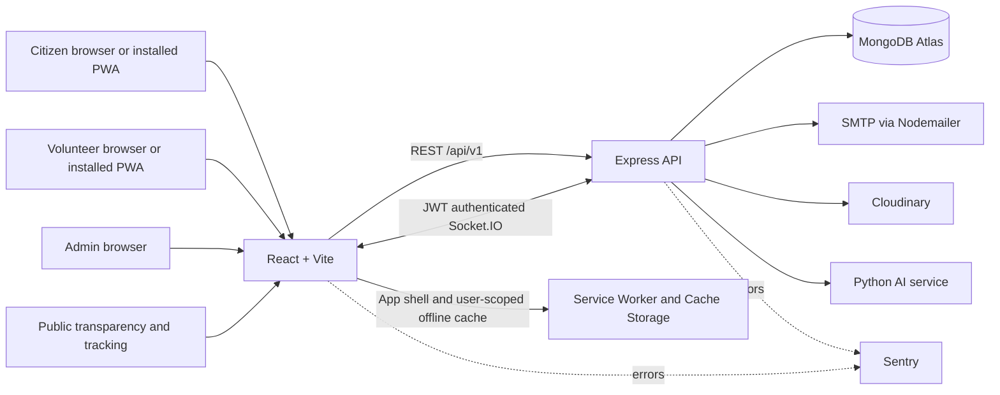

# StreetSetu Final Production Release

## Release scope

StreetSetu is a civic complaint workflow platform for citizens, volunteers, and administrators. The final release adds an installable offline-capable web app, SMTP email templates, public transparency and tracking pages, performance reporting, broader admin exports, and stronger realtime/session checks while retaining the existing `/api/v1` contracts.

## Architecture



The API is authoritative for permissions, complaint lifecycle, reporting queries, and audit history. The frontend cache supports read-only offline snapshots; it does not queue or submit writes offline. Public APIs expose aggregate city statistics and a limited complaint tracking projection.

## Feature matrix

| Capability | Citizen | Volunteer | Admin | Public |
|---|---:|---:|---:|---:|
| Complaint submission, evidence, maps, and duplicate warning | Yes | Yes | Yes | — |
| Nearby complaint discovery before submission | Yes | — | — | — |
| Volunteer assignment and optimized daily route | — | Route | Assign/recommend | — |
| Complaint updates and in-app/email notification | Own complaints | Assigned work | Operations | — |
| Geographic and duplicate analytics | — | Personal metrics | Executive dashboard | Aggregate snapshot |
| CSV/PDF operational reports | — | — | Yes | — |
| City transparency and complaint tracking | — | — | — | Yes |
| Installable PWA and offline snapshots | Yes | Yes | Yes | Public shell |

## API overview

All API routes use `/api/v1`. Existing APIs are retained; the new public and reporting routes are:

| Method and path | Access | Description |
|---|---|---|
| `GET /public/transparency` | Public | Aggregate counts, resolution rate/time, top categories/areas, rounded heatmap zones. |
| `GET /public/complaints/:complaintId` | Public | Current status, assigned volunteer name, and status timeline projection. |
| `GET /dashboard/export/volunteers.csv` | Admin | Volunteer profile and performance export. |
| `GET /dashboard/export/analytics.csv` | Admin | Dashboard totals, categories, statuses, and monthly trends. |
| `GET /dashboard/export/monthly.pdf?month=YYYY-MM` | Admin | Selected month report. |
| `GET /dashboard/export/admin.pdf` | Admin | Executive report with volunteer and geo summaries. |
| `GET /dashboard/export/volunteer.pdf?volunteerId=<id>` | Admin | Individual volunteer performance report. |

The complete endpoint contracts and filters are in [`api-design.md`](api-design.md). Public responses omit reporter contact/identity and exact complaint coordinates. `/track/:complaintId` is a shareable public status page; protect tracking links as public information.

## PWA and offline behavior

- `frontend/public/manifest.json` defines app name, launch route, colors, and scalable SVG icons.
- `frontend/public/service-worker.js` installs the app shell, caches same-origin static assets, and returns the shell for offline navigation.
- The API client caches successful reads of dashboard summary, complaint lists, and notifications using a per-user Cache Storage namespace. It reads those snapshots only after a network failure.
- Logout and expired sessions clear private offline caches. Do not cache uploads or mutations; offline report submission is intentionally unavailable.
- The install button appears when the browser dispatches `beforeinstallprompt`. Browsers without that event use their built-in “Add to Home Screen” browser menu.
- Deploy over HTTPS (localhost is allowed for development). Bump the service-worker cache version when changing cached shell assets or cache semantics.

## Email notifications

Nodemailer sends HTML and plain-text notification templates for submission, assignment/reassignment, resolution, rejection, and volunteer assignment. Email rendering escapes user-provided text and links to `/track/:complaintId`. SMTP is optional for local development; failures are recorded in existing notification records and do not roll back complaint updates.

Configure `SMTP_HOST`, `SMTP_PORT`, `SMTP_SECURE`, `SMTP_USER`, `SMTP_PASSWORD`, `SMTP_FROM`, and `PUBLIC_APP_URL`. For production delivery, configure SPF/DKIM/DMARC for the sender domain, use a dedicated SMTP credential, and monitor failed notification records.

## Volunteer performance and reporting

Volunteer dashboards show total and resolved assignments, average completion time, resolution rate, route efficiency score, and rank. Route plans use a greedy nearest-neighbour order and Haversine straight-line distance; estimated travel time assumes walking at 4.5 km/h and is not a road-network ETA. Admin reports include complaint/volunteer trends, duplicate prevention, top volunteers, and hotspot zones. CSV values are escaped against spreadsheet formula injection.

## Production security and operations

- Access JWTs are held in frontend memory; refresh JWTs are HttpOnly, Secure in production, SameSite=None for the cross-subdomain deployment, and stored hashed in MongoDB refresh sessions.
- Access/refresh secrets must be separate random values of at least 32 characters. JWT verification pins HS256.
- Express uses Helmet, allowlisted credentialed CORS, bounded request bodies, request IDs, validated inputs, authentication/general rate limits, and optional Sentry.
- Socket.IO verifies the JWT and current active user/role, authorizes complaint-room joins, and limits connection and room-join rates in-process.
- Current rate limiting and Socket.IO limits are process-local. Add shared stores/adapters before horizontal scaling; see the roadmap.
- Public tracking IDs are shareable. Public projections omit email, phone, reporter identity, actor identifiers, and free-text internal notes.

## Deployment guide

### Environment

1. Use Node 22 and install from the committed lockfile: `npm ci` at the repository root (or install backend and frontend from their package folders when deploying separately).
2. Provision MongoDB Atlas with TLS, a least-privilege app user, and network access restricted to the API deployment.
3. Configure backend `MONGO_URI`, `JWT_SECRET`, `JWT_REFRESH_SECRET`, `CLIENT_ORIGIN`, optional `CORS_ALLOWED_ORIGINS`, and `TRUST_PROXY_HOPS`.
4. Configure `PUBLIC_APP_URL` as the canonical public frontend URL. Configure SMTP variables to enable email; Cloudinary and Sentry remain optional integrations.
5. Configure frontend `VITE_API_URL`, `VITE_SOCKET_URL`, and optional `VITE_SENTRY_DSN`. These values are public build-time settings and must not contain credentials.

### Hosting

1. Deploy `backend/` as the API service (the repository’s Render configuration is the reference) and expose `/api/health` for health checks.
2. Deploy `frontend/` as a Vite static site with SPA fallback (the Vercel configuration is the reference). Confirm that `manifest.json`, service worker, and icon paths return successfully.
3. Use related custom domains such as `app.example.com` and `api.example.com` for refresh-cookie compatibility; unrelated vendor domains can be blocked by third-party cookie policies.
4. Add the exact frontend origin to backend CORS configuration. Keep credentials enabled and wildcard origins disabled in production.
5. Confirm MongoDB indexes exist, SMTP delivery works, the API health check passes, and the PWA installs and reloads with a network connection disabled.
6. Configure repository deploy secrets only in the hosting/CI secret stores. Never commit `.env` files or production screenshots containing real citizen data.

### Docker and CI

`docker-compose.production.yml` runs the API and static frontend containers; supply the documented variables at runtime. `.github/workflows/ci.yml` runs backend tests and the frontend production build. `npm run lint` currently reports that no repository lint configuration is set; see final validation and roadmap.

## Screenshots

Store sanitized, current screenshots in `docs/screenshots/`. Do not include citizen names, email addresses, precise home locations, or unredacted complaint photos.

| Screenshot | Suggested file |
|---|---|
| Citizen complaint form with nearby discovery | `docs/screenshots/citizen-nearby-discovery.png` |
| Public transparency page | `docs/screenshots/public-transparency.png` |
| Volunteer optimized route and map | `docs/screenshots/volunteer-route.png` |
| Admin executive dashboard and heatmap | `docs/screenshots/admin-executive-dashboard.png` |

No screenshots are checked into this release because no sanitized deployment capture was supplied.

## Validation

Run from the repository root:

```bash
npm test --prefix backend
npm run build --prefix frontend
npm run lint
```

The backend test script is Node’s built-in test runner. The lint script is currently a placeholder and no ESLint/Prettier configuration is present.

## Future roadmap

- Add lint/type-checking configuration and API integration tests against MongoDB test containers.
- Move email delivery to a queue with retry/backoff and delivery webhooks for high-volume deployments.
- Use Redis/shared rate-limit storage and a Socket.IO adapter before running multiple API instances.
- Add encrypted/expiring offline cache policies and a configurable retention/clear-data control for shared devices.
- Replace Haversine route distance with an approved road-routing provider where operational ETAs are needed.
- Add consent-driven public tracking tokens if ObjectId-based share links require stronger privacy.
- Add automated deployment smoke tests, rollback procedures, and sanitized screenshots from staging.
